## Дипломный проект- Хрипун Алексей


Проект состоит из двух этапов: 
1. подготовка бакета S3 для файла tfstate, таблица YDB для блокировки файла tfstate, создание двух сервисных учетных записей (k8s-sa для создания инфраструктуры проекта и image-puller - для скачивания docker-образов из Registry) и  YC Registry.
2. основной этап, включающий создание инфраструктуры и управление кодом приложения и terraform.

Этап 1. Создается бакет S3 и таблица YDB с локальным хранением файла состояния. Также создается отдельный сервисный аккаунт с нужными правами.
Поскольку Document API в YDB полностью совместим с протоколом Amazon DynamoDB, Yandex Cloud может использовать **resource "aws_dynamodb_table"** при условии, что объявлен провайдер **aws**.

При создании таблицы блокировки tfstate база данных еще не создалась полностью, но облако уже объявило, что база готова и в ту же миллисекунду запустился процесс создания таблицы. Но по факту база данных еще не была готова. Была выдана ошибка. При повторном запуске ошибка ушла. Чтобы предотарвтить в дальнейшем появления этой ошибки, было принято решение вставить блок-паузу на 10 сек. (файле providers.tf нужно прописать провайдер time). Добавляем блок time_sleep сразу после базы данных, а в ресурсе таблицы yandex_ydb_table указываем зависимость от этой паузы.

Этап 2. После создания S3 и базы YDB переключаем backend на S3.

Поскольку инициализация бэкенда происходит до того, как Terraform начнет выполнять код и создавать ресурсы, не получится  динамически подставить переменные или ссылки на ресурсы (вроде yandex_ydb_database_serverless) внутрь блока backend. Все значения там должны быть жесткими строками (hardcoded) или передаваться через файлы конфигурации бэкенда. Поэтому для получения ключа доступа нужно выполнить экспорт переменных:
```
#!/bin/bash
export AWS_ACCESS_KEY_ID="XXXX"
export AWS_SECRET_ACCESS_KEY="XXXXX"

eval $(ssh-agent)
ssh-add /home/alex/.ssh/alex
```
Зупаскаем terraform-проект и получаем инфраструктуру:

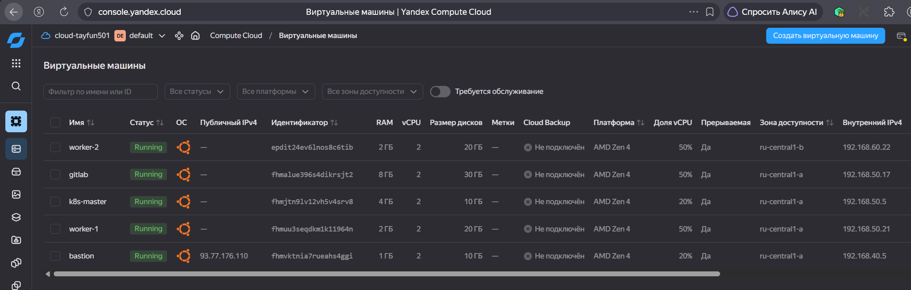

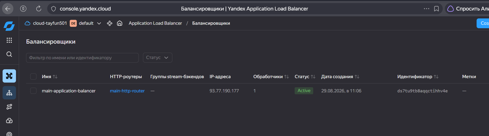

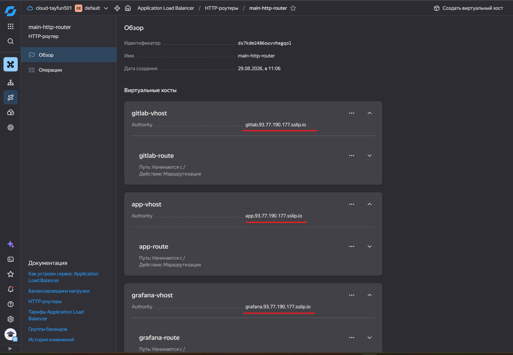

## Кластер Kubernetes
Запускаем playbook [k8s_kluster.yml](./ansible_kuber/k8s_kluster.yml). Он содержит в себе три плейбука:
1. k8s-install.yml(./ansible_kuber/k8s-install.yml) - выполняется на всех нодах кластера (устанавливает и готовит систему для Kubernetes).
2. k8s-master.yml(./ansible_kuber/k8s-master.yml) - выполняется на master-нодах
3. k8s-worker-add.yml(./ansible_kuber/k8s-worker-add.yml) - выполняется на worker-нодах (присоединяет их к кластеру)


С удаленной master-ноды копируем файл конфигурации:
```
ssh -J alex@93.77.176.110 alex@192.168.50.5 "sudo cat /etc/kubernetes/admin.conf" > /home/alex/.kube/config
```
В этом фвйле удаляем строку certificate-authority-data, в строке server исправляем адрес на https://127.0.0.1:6443 и добавляем строку **insecure-skip-tls-verify: true** (для отключения проверки TLS-сертификата при подключении. Удаленный API-сервер Kubernetes подписывает свой трафик TLS-сертификатом и этот сертификат жестко привязан к IP-адресу удаленного сервера. Локальный kubectl обращается к 127.0.0.1, а ответ получает через туннель от 1192.168.50.34 (удаленный K8S). Если не отключить проверку сертификата, то трафик будет заблокирован из-за подозрения атаки Man-in-the-Middle).

Через ssh-туннель проверяем статус кластера:
```
ssh -f -N -J alex@93.77.176.110 -L 6443:192.168.50.5:6443 alex@192.168.50.5
kubectl get nodes
kubectl cluster-info
kubectl get pods --all-namespaces
```

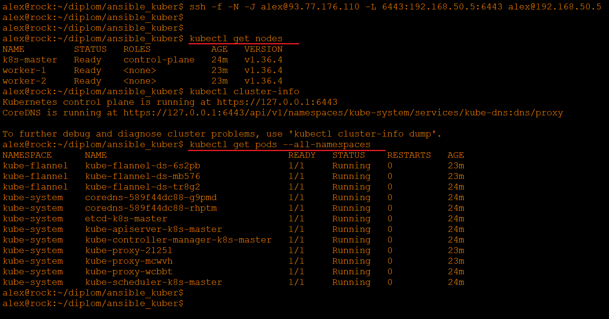


## Создание тестового приложения

В качестве приложения будет использоваться статическая стратица index.html. Соберем docker-образ с помощью [dockerfile](dockerfile) и поместим этот образ в созданный YC Registry:
```
docker tag nginx_alex:1.30.4 cr.yandex/crpfsj6kk1tn7isut41s/nginx_alex:1.30.4
docker push cr.yandex/crpfsj6kk1tn7isut41s/nginx_alex:1.30.4
```

Создается секрет в Kubernetes для скачивания образа для сервисной учетной записиimage-puller:
kubectl create secret docker-registry yc-registry-secret \
  --docker-server=cr.yandex \
  --docker-username=json_key \
  --docker-password="$(cat /home/alex/.key/image-puller-key.json)" \
  --namespace=default

Производим тестовый deploy приложения [deployment-backend.yaml](./k8s/deployment-backend.yaml)  

Проверяем:

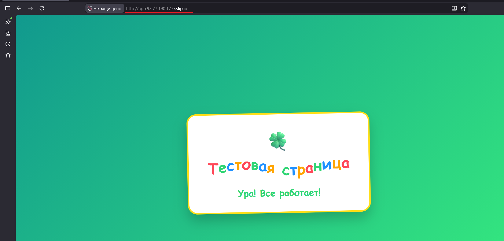


## Мониторинг.
Убедившись, что команды kubectl через туннель проходят, можно установить helm. Для установки стека Prometheus добавим репозиторий:
```
helm repo add prometheus-community https://prometheus-community.github.io/helm-charts
helm repo add ingress-nginx https://kubernetes.github.io/ingress-nginx
helm repo update
helm repo list
```
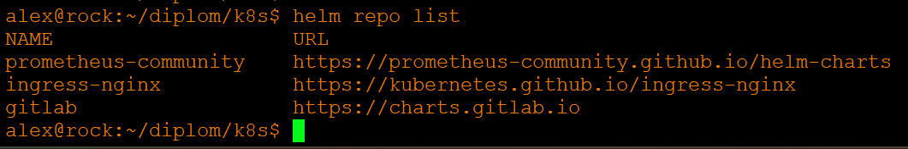

В кластере Kubernetes создаем отдельный namespace для мониторинга и заодно для GitLab (позже пригодится):
```
kubectl create namespace monitoring
kubectl create namespace gitlab
kubectl create namespace gitlab-runner
```

Устанавливаем kube-prometheus-stack:
```
helm install monitoring prometheus-community/kube-prometheus-stack \
  --namespace monitoring \
  --create-namespace \
  --set grafana.adminPassword=p@ssword12345 \
  --set prometheus.prometheusSpec.serviceMonitorSelectorNilUsesHelmValues=false \
  --set prometheus.prometheusSpec.podMonitorSelectorNilUsesHelmValues=false \
  --set grafana.service.type=NodePort \
  --set grafana.service.nodePort=30001
  ```

Эта команда устаналивает kube-prometheus-stack в пространство имен **monitoring**:
--create-namespace - создаст это пространстао имен, если его еще нет (будет проигнорировано, т.к. было создано вручную)
--set grafana.adminPassword=p@ssword!@# - устанавливаем пароль для входа в интерфейс Grafana (После входа в Web-интерфейс меняем пароль), логин по умолчанию - admin.
--set prometheus.prometheusSpec.serviceMonitorSelectorNilUsesHelmValues=false - если этот флаг **true** (по умолчанию), Prometheus будет собирать метрики только с тех объектов ServiceMonitor, у которых есть специальный лейбл, жестко привязанный к вашему Helm-релизу (например, release: monitoring). Если будет развернуто приложение со своим ServiceMonitor (без этого специфического лейбла), Prometheus его просто проигнорирует. Если это ограничение выключено (false), то Prometheus будет автоматически находить и собирать метрики со всех ServiceMonitor в кластере независимо от меток на них.
--set prometheus.prometheusSpec.podMonitorSelectorNilUsesHelmValues=false - идентично предыдущему параметру, но применяется к объектам PodMonitor (метрики собираются напрямую с подов, минуя K8S Service).
--set grafana.service.type=NodePort - меняет тип службы Grafana с внутренненго (ClisterIP поу молчанию) на NodePort и жестко фиксируем порт командой --set grafana.service.nodePort=30001.

Проверяем:
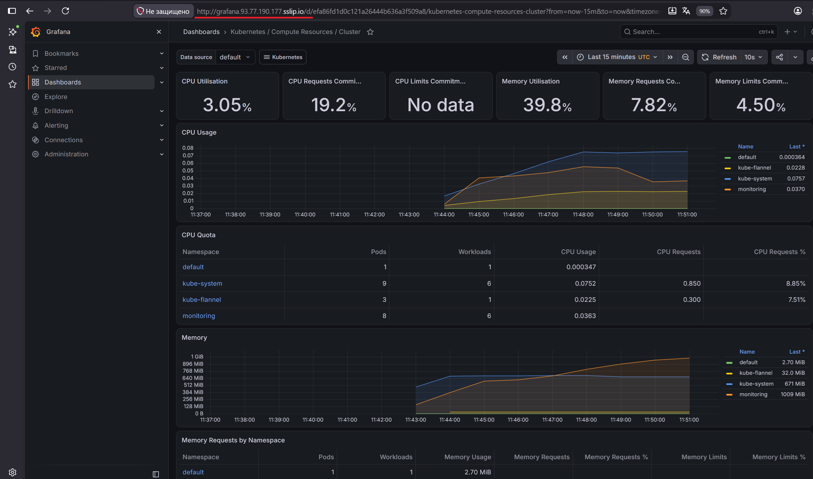

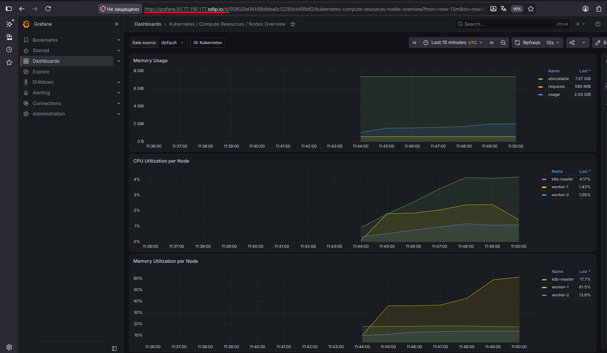

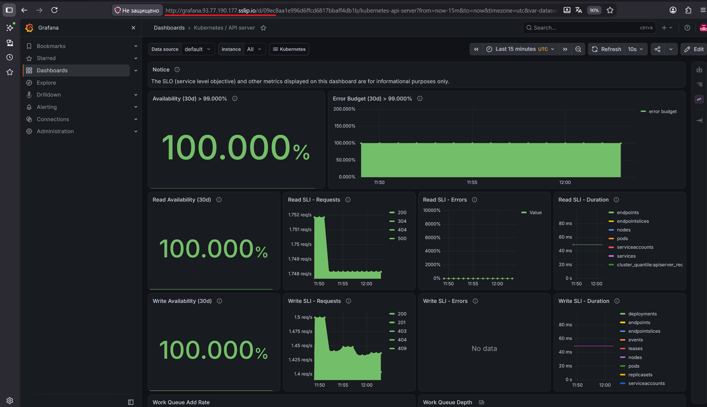


Теперь можно установить GitLab с помощью [плейбука](./ansible_kuber/gitlab_install.yml). После установки заходим, проводим первичные настройки, и создаем два новых проекта:
1. terra - для управления инфраструктурой terraform
2. app - для приложения 

Также нужно на GitLab добавить открытый ключ (для синхронизации Git-репозитория по SSH), и personal access token (для регистрации раннеров).Токен сохраняем в файл.
Теперь нужно создать раннер. Т.к. web-интерфейс виснет, создаем раннер через CLI:
```
curl --request POST "http://192.168.50.17/api/v4/user/runners" \
  --header "PRIVATE-TOKEN: $(cat /root/.gitlab_token)" \
  --header "Content-Type: application/json" \
  --data '{
    "runner_type": "project_type",
    "project_id": 2,
    "description": "project-runner",
    "run_untagged": true,
    "tag_list": ["terra", "docker"]
  }'
  ```
Получаем раннер и уникальный токен для регистрации (glrt-xxxx). Перерь раннеры нужно установить и зарегистрировать в кластере K8S:
```
export GITLAB_RUNNER_TOKEN_TERRA="glrt-xxx"

helm install gitlab-runner gitlab/gitlab-runner \
  --namespace gitlab-runner \
  --create-namespace \
  --set gitlabUrl="http://192.168.50.17" \
  --set runnerToken="$GITLAB_RUNNER_TOKEN_TERRA" \
  --set rbac.create=true \
  --set rbac.clusterWideAccess=true \
  --set serviceAccount.create=true \
  --set runners.kubernetes.namespace="gitlab-runner" \
  --set runners.kubernetes.image="ubuntu:22.04" \
  --set runners.kubernetes.privileged=false
```
Проверяем:
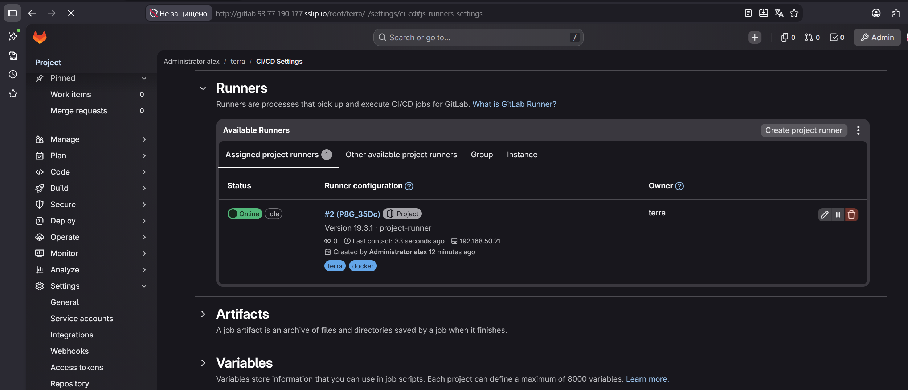

Теперь в GitLan нужно установить переменные:
AWS_ACCESS_KEY_ID
AWS_SECRET_ACCESS_KEY
YC_SERVICE_ACCOUNT_KEY_FILE (тип переменной File)

Теперь сожно синхронизировать git-репозиторий проекта terra на Gitlab. Для удобства нужно настроить файл ~/.ssh/config:
```
Host bastion
    HostName 93.77.176.110
    User alex
    IdentityFile ~/.ssh/alex

Host 192.168.50.17
    User git
    IdentityFile ~/.ssh/alex
    ProxyJump bastion
```
Теперь можно подключаться к git-репозиторию GitLab как к обычному хосту по его внутреннему IP:
```
git clone git@192.168.50.17:root/terra.git
```
В репозиторий добавляются файлы проекта и файл [.gitlab-ci.yml](./terra/.gitlab-ci.yml), который управляет CI/CD pipelines в GitLab. После выполнения команды **git push**, будет выполнен pipeline. Основные моменты:
- Все задачи pipeline будут выполняться внутри официального Docker-контейнера Terraform версии 1.15.5. 
- **entrypoint: [""]** необходим, чтобы CitLab мог запускать внутри контейнера свои произвольные команды (по умолчанию образ Terraform сразу попытается выполнить команду terraform).
- **TF_IN_AUTOMATION: "true"** - переводит Terraform в режим автоматизации (скрывает лишний вывод, оптимизируя логи для CI/CD)
- **.terraform_base** - это скрытый базовый шаблон, который будет использован во всех трех задачах (init, plan и apply). 
- **Stage init**. ОТвечает за инициализацию рабочего каталога Terraform. Выполняется тест подключения к зеркалу terraform в Yandex Cloud (а в случае сбоя подключения это тест поможет в отладке проблемы), а т.к. curl в образе Terraform нет - утилита устанавливается. Блок **atrifacts** указывает какие файлы нужно сохранить после успешного выполнения джобы и передать на следующие этапы выполнения pipeline (name указывает назание архива с артефактами, path - список сохраняемых файлов). В этой джобе сохраняем папку **./terraform** со скачанными модулями и бинарными файлами провайдеров, чтобы следующая джоба их нашла, и файл **.terraform.lock.hcl**, который фиксирует точные версии и контрольные суммы скачанных провайдеров. Время жизни артифактов - 1 час (автоматически удалятся через час). Этого времени должно хватить для прохождения стадий plan и apply.
- **Stage plan**. Это генерация плана изменений. В блоке **dependencies:** явно указываем GitLab скачать артефакты, которые были созданы в джобе terraform_init. Затем запускается команда **- terraform plan -out=plan.tfplan**, которая сохранит план изменений в бинарный файл plan.tfplan. Это очень важно для безопасности на стадии apply, когда Terraform применит эти изменения имеено из этого сохраненного файла. В инфраструктуру применится в точности то, что будет выведено в логах деплоя. В блоке **artifacts** сохраняем результаты (сохраненный сгенерированный план). Время жизни 7 дней (лог планирования может быть очень большим и нужно время, чтобы в нем разобраться, перед тем, как нажать кнопку Apply). В блоке **rues** прописано условие запуска - эта джоба запустится только тогда, когда изменения попадут в ветку main.
- **Stage apply**. Отвечает за применение изменений в инфраструктуру. Блок **dependencies:** берет результаты работы предыдущих стадий (хеши версий и план изменений) и выполняет команду **- terraform apply -auto-approve -input=false plan.tfplan**. Команда выполнит только те изменения, которые были расситаны на стадии plan (любые изменения в коде, произошедшие после генерации этого файла, будут проигнорированы). Кроме того отключается интерактивный запрос на подтверждение и отключается запрос переменных через терминал (если какие-то переменные не были заданы - команда завершится с ошибкой). Условие запуска - джоба запустится только в ветке main. **when: manual** - это крайне важная настройка для безопаснояти. Это предохранитель. Pipeline не применит изменения автоматически. Произойдет остановка и инженер должен вручную нажать кнопку Run на этой джобе. Это позволяет глазами изучить изменения, и если все в порядке - нажать Run.

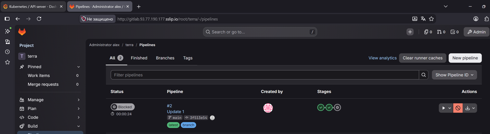

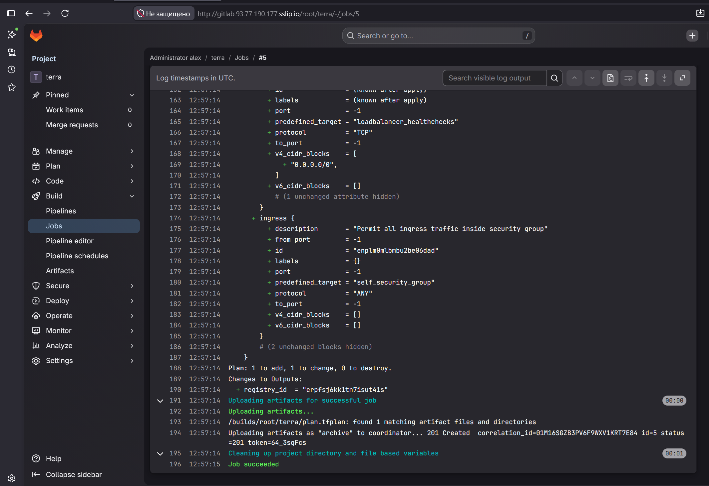

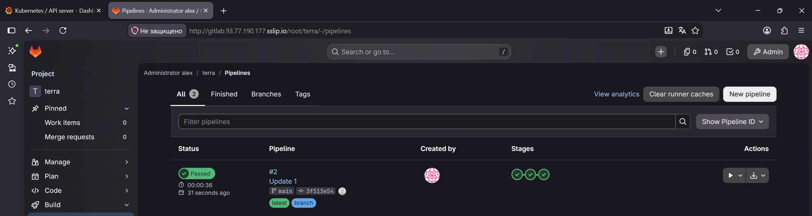


Теперь создаем проект для приложения и склонируем его репозиторий:
```
git clone git@192.168.50.17:root/app.git
```

Для этого проекта также нужно создать и зарегистрировать свои раннеры (здесь ID проекта уже 3, тег - app и будет свой токен регистрации):
```
curl --request POST "http://192.168.50.17/api/v4/user/runners" \
  --header "PRIVATE-TOKEN: $(cat /root/.gitlab_token)" \
  --header "Content-Type: application/json" \
  --data '{
    "runner_type": "project_type",
    "project_id": 3,
    "description": "project-runner",
    "run_untagged": true,
    "tag_list": ["app", "docker"]
  }'
```
Регистрируем:
```
export GITLAB_RUNNER_TOKEN_APP="glrt-xxx"

helm install gitlab-runner-app gitlab/gitlab-runner \
  --namespace gitlab-runner \
  --create-namespace \
  --set gitlabUrl="http://192.168.50.17" \
  --set runnerToken="$GITLAB_RUNNER_TOKEN_APP" \
  --set rbac.create=true \
  --set rbac.clusterWideAccess=true \
  --set serviceAccount.create=true \
  --set runners.kubernetes.namespace="gitlab-runner" \
  --set runners.kubernetes.image="ubuntu:22.04" \
  --set runners.kubernetes.privileged=false
```
Проверяем:
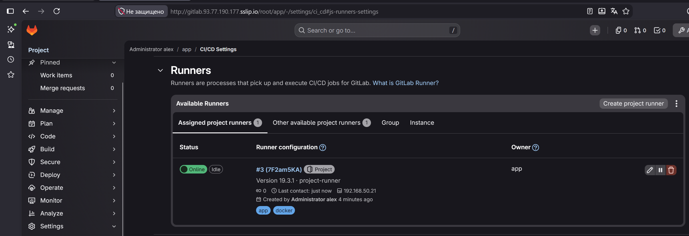


Kaniko — это инструмент от Google для сборки Docker-образов внутри контейнера без использования Docker-демона (Docker-in-Docker / DinD). Это стандарт безопасности для Kubernetes-раннеров, так как сборка не требует root-привилегий хоста (флага --privileged).

В GitLab нужно создать Deploy token (чтобы внешние системы, вроде K8S, могли безопасно скачивать Docker-образы из проекта). На основе этого токена создается секрет в K8S для додступа к регистри GitLab:
```
kubectl create secret docker-registry gitlab-registry-secret \
  --docker-server=192.168.50.17:5050 \
  --docker-username="alex1" \
  --docker-password="gldt-xxxx" \
  --docker-email="ci@192.168.50.17" \
  -n default
```
Также нужно добавить переменную KUBECONFIG, значение которой содержимоефайла ~/.kube/config  (токен и адрес кластера). Не забываем указать тип переменной File.

Теперь нужно добавить в репозиторий [Dockerfile](./app/Dockerfile) и [приложение](./app/index.html) (статическая стратица index.html). Также нужно создать [GitLab CI/CD конфиг](./app/.gitlab-ci.yml) для сборки и деплоя приложения. 
Основные моменты конфигурации:
- в переменных указываются адрес и порт Container Registry, COMMIT_IMAGE - шаблон, по которому GitLab автоматически собирает полный путь для DOcker-образа при каждом push в ветку (состоит адреса registry, пути к проекту (имя пользователя/группы + имя репозитория) и после разделителя 8 симолов хеша (ID) конкретноо коммита. В результате при каждом коммите создается новый образ с уникальным тегом). Также указывается переменная TAG_IMAGE - шаблон имени Docker-образа, который используется тлько для официальных версий (не простых коммитов). Здесь после разделителя вместо случайного хеша используется имя тега.
Переменная COMMIT_IMAGE используется для разработки, а TAG_IMAGE - для релизов.

- далее идет шаблон сборки (.build_template:). Используется Kaniko, причем отладочная версия, т.к. в ней есть shell, без которой не получится выполнить команды из before_script и script. Задача назначается на раннер с тегом app. **before_script:** создает файл авторизации /kaniko/.docker/config.json, в который передаются значения встроенных переменных для уатентификации Kaniko в реестре, чтобы загружать туда собранный образ. Ранее в проекте был создан Deployment token и данные аутентификации для встроенных переменных GitLab берутся из него ($CI_REGISTRY_USER и $CI_REGISTRY_PASSWORD). **script** запускает /kaniko/executor и из папки проекта загружает файлы из нее в память (флаг --context. Поэтому важно в папке проекта держать только нужные файлы (ничего лишнего) и уж тем более там не должно быть файлов с секретами (они попадут в контекст сборки и они могут быть скопированы внутрь Docker-образа)), находит Dockerfile и отправляет готовый образ в репозиторий (${TARGET_IMAGE}). Флаг --insecure разрешает Kaniko отправлять образ в реестр по протоколу HTTP без SSL/TLS сертификатов.

- далее задачи build_commit (сборка для веток) и build_tag (сборка для тегов) используют описанный шаблон. Задача build_commit передает в шаблон имя образа с хешем коммита. В правиле прописано, что если это push тега - задача игнорируется (when: newer). Если это обычный push в любую ветку - задача запускается. Задача build_tag запускается только если созданный тег соответствует регулярному выражению (символ v и три блока цифр, в каждом блоке цир одна или более через разделитель-точку). Например v1.0.0

- этап деполя. Отвечает за автоматическое обновление приложения в K8S. Используется образ от Bitnami с утилитой kubectl для выполнения команд из блока script внутри этого контейнера.  (не нужно прописывать команды для установки kubectl при каждом апуске конвейера). Блок script сначала находит в deployment-файле приложения заглушку __IMAGE_PLACEHOLDER__ и заменяет его на реальное имя и тег Docker-образа(хранится в переменной ${TAG_IMAGE}), чтобы K8S понимал какую версию приложения надо скачать и запустить. Далее обновленный файл конфигурации отправляется в Kubernetes в пространство имен default. Перед выводом списка всех подов с меткой app=backend в namespace default в лог сьборки ждем 15 секунд (чтобы обновление точно успело пройти). В условии задачи прописано, что задача запустится, если был задан правильный тег (символ v и три группы цифр через точку). Без тега задача будет проигнорирована.

При выполнении проекта столкнулся с тем, что worker-ноды все еще пытались использовать HTTPS. На worker нодах приписываем:
```
mkdir -p /etc/containerd/certs.d/192.168.50.17:5050
vim /etc/containerd/certs.d/192.168.50.17:5050/hosts.toml
```  
В файле прописываем
```
  server = "http://192.168.50.17:5050"

[host."http://192.168.50.17:5050"]
  capabilities = ["pull", "resolve"]
  skip_verify = true
```
Перезапуск containerd:
```
systemctl restart containerd
```
Т.к. раннеры создавались в namespace gitlab-runner, а поды нужно создавать в namespase default, раннерам нужно дать полномочия в этом namespase. Для простоты используем команду:
```
kubectl create rolebinding runner-default-edit \
  --clusterrole=edit \
  --serviceaccount=gitlab-runner:gitlab-runner \
  --namespace=default
```

Запускаем и проверяем. Выполним изменения (например, в index.html изменим версию) и выполним коммит и push:
```
git commit -am "Update v3.0.0"
```

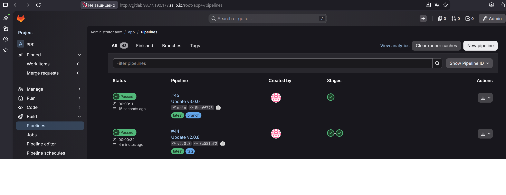

Выполнилсяь одна задача. Деплоя нет. Теперь с тегом:
```
git tag v3.0.0
git push origin v3.0.0
```
Выполнился также и деплой приложения:

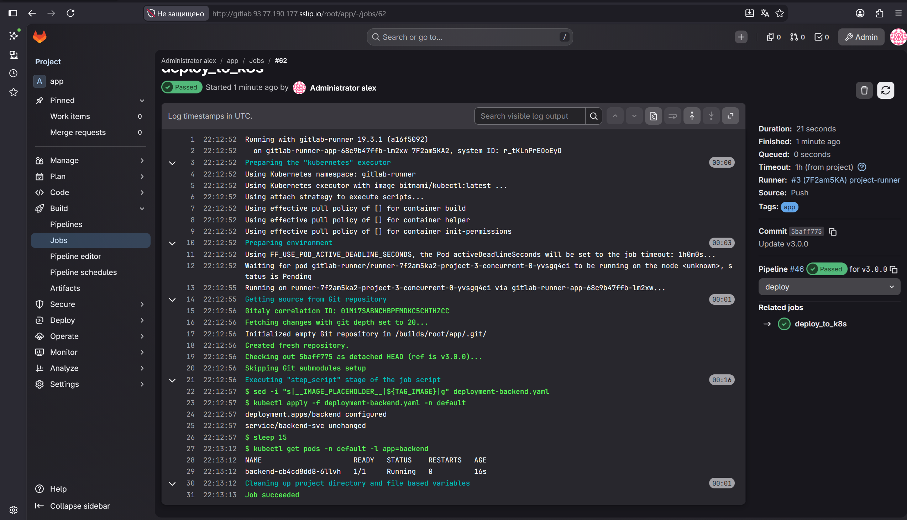

Обновляемся до v3.0.1:

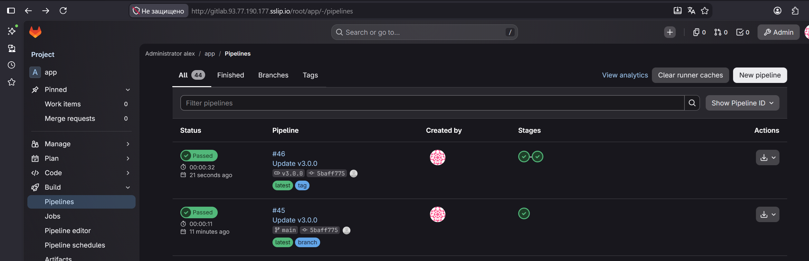

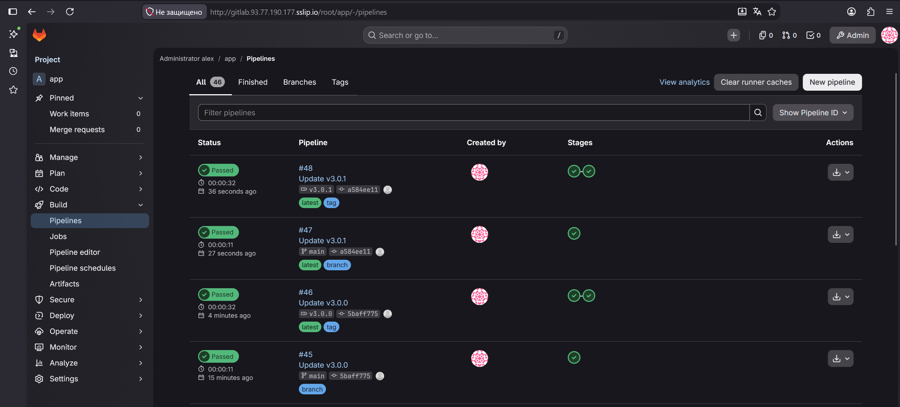

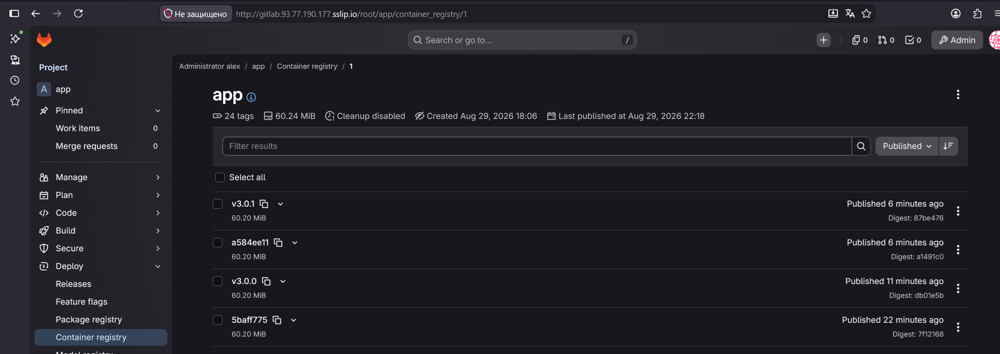

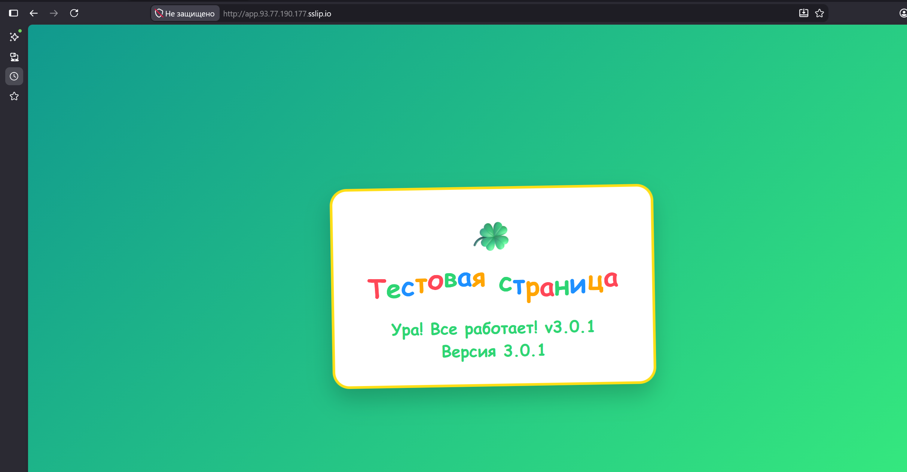


